# 📦 Supply Chain Analytics Dashboard with Demand Forecasting

An end-to-end, industry-style **Data Analytics + Machine Learning** project built
with Python and Streamlit. It covers the full pipeline from synthetic data
generation through cleaning, exploratory analysis, business KPIs, and
ML-powered demand forecasting — all wrapped in an interactive, filterable
dashboard.

---


## 🚀 Features

- **55,000+ row synthetic supply chain dataset** (orders, products, suppliers,
  warehouses, shipping, inventory, demand, and more)
- **Full data cleaning pipeline**: missing values, duplicates, outlier
  clipping, type fixes, feature engineering
- **30+ EDA visualizations**: trends, top-N charts, heatmaps, correlation
  matrix, distributions, boxplots, scatter/pair plots, seasonal & geographic
  breakdowns, ABC/Pareto analysis
- **12 headline business KPIs**: revenue, profit, orders, delivery/lead time,
  inventory turnover, stock availability, delay %, return rate, supplier
  score, warehouse utilization, forecast accuracy
- **Demand forecasting** with Linear Regression, Random Forest, and XGBoost —
  compared on MAE / RMSE / R², with feature importance and a 7–90 day future
  forecast
- **9-page interactive Streamlit dashboard** with dark/light theme,
  multi-filter sidebar (date, country, warehouse, supplier, category,
  product, transport mode, free-text search), CSV export, and PDF report
  generation
- **Modular, PEP8-friendly codebase** — reusable `src/` modules, not a single
  monolithic script

---

## 📈 Key Business Insights

This dashboard enables businesses to:

- 📊 Monitor sales, revenue, and profit trends.
- 📦 Track inventory levels and identify low-stock items.
- 🚚 Evaluate supplier performance and delivery efficiency.
- 🏭 Analyze warehouse utilization and operational performance.
- 🤖 Forecast future product demand using Machine Learning.
- 📈 Support data-driven decision-making through interactive dashboards and KPIs.

## 🗂️ Folder Structure

```
supply_chain_dashboard/
├── app.py                     # Streamlit dashboard (entry point)
├── config.py                  # Central paths & constants
├── requirements.txt
├── README.md
├── data/
│   └── supply_chain_data.csv  # Generated synthetic dataset (55k+ rows)
├── notebooks/                 # (optional) exploratory notebooks
├── src/
│   ├── __init__.py
│   ├── data_generator.py      # Synthetic dataset generator
│   ├── data_processing.py     # Cleaning, feature engineering, filters
│   ├── kpi.py                 # KPI, ABC analysis, supplier/warehouse ranking
│   ├── visualizations.py      # Plotly chart builders
│   └── forecasting.py         # Model training, evaluation, forecasting
├── model/
│   ├── best_demand_model.joblib   # Saved best model (generated on first run)
│   └── label_encoders.joblib      # Saved encoders for inference
└── assets/
    └── style.css               # Dashboard theming
```

---

## 🛠️ Installation (Windows)

1. **Install Python 3.10+** if you don't already have it (from python.org),
   and make sure "Add Python to PATH" is checked during installation.

2. **Open Command Prompt / PowerShell** in the project folder:
   ```bash
   cd path\to\supply_chain_dashboard
   ```

3. *(Recommended)* Create and activate a virtual environment:
   ```bash
   python -m venv venv
   venv\Scripts\activate
   ```

4. **Install dependencies:**
   ```bash
   pip install -r requirements.txt
   ```

---

## ▶️ How to Run

The dataset (`data/supply_chain_data.csv`) is already generated and included,
so you can launch the dashboard immediately:

```bash
streamlit run app.py
```

Your browser will open automatically at `http://localhost:8501`.

**To regenerate the dataset** (e.g. with a different random sample):
```bash
python src/data_generator.py
```

**First-time forecasting:** Open the "🔮 Demand Forecasting" page and click
**"Train / Retrain Models"** — this trains and compares all three models and
saves the best one to `model/best_demand_model.joblib` for reuse.

---

## 🧠 Required Libraries

| Library | Purpose |
|---|---|
| pandas / numpy | Data manipulation |
| scikit-learn | Linear Regression, Random Forest, metrics, preprocessing |
| xgboost | Gradient-boosted forecasting model |
| plotly | Interactive charts |
| streamlit | Dashboard framework |
| joblib | Model persistence |
| scipy | Statistical helpers |
| matplotlib / seaborn | Static plotting support |
| fpdf2 | PDF report export |

All are pinned in `requirements.txt`.

---

## 📸 Screenshots

## 📸 Dashboard Preview

Explore the interactive pages of the **Supply Chain Analytics Dashboard**.

---

### 🏠 Dashboard Overview

The landing page provides a complete summary of the supply chain with key business KPIs, filters, and quick insights.

<p align="center">
  
</p>

---

### 📊 Home Dashboard

A high-level overview of sales, inventory, warehouse performance, supplier analytics, and overall business metrics.

<p align="center">
  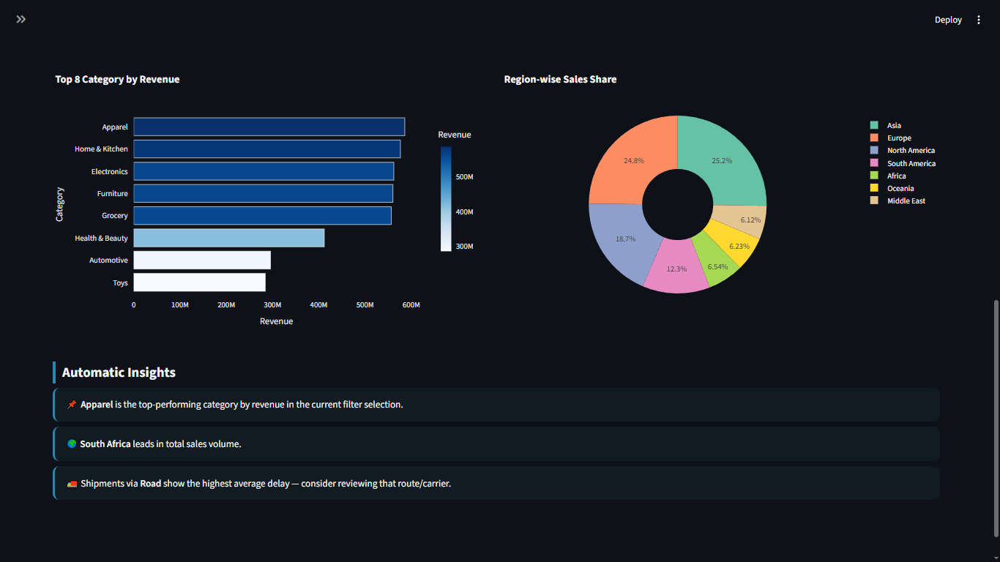
</p>

---

### 💰 Sales Analytics

Analyze revenue, profit, order trends, top-selling products, and sales performance through interactive charts.

<p align="center">
  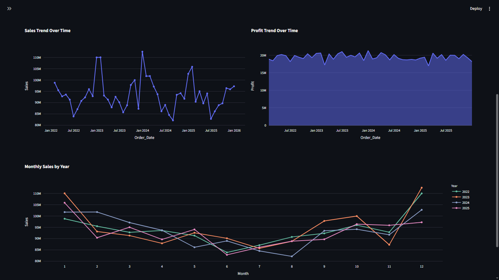
</p>

---

### 📦 Inventory Analytics

Monitor stock levels, inventory turnover, ABC analysis, and identify products that require replenishment.

<p align="center">
  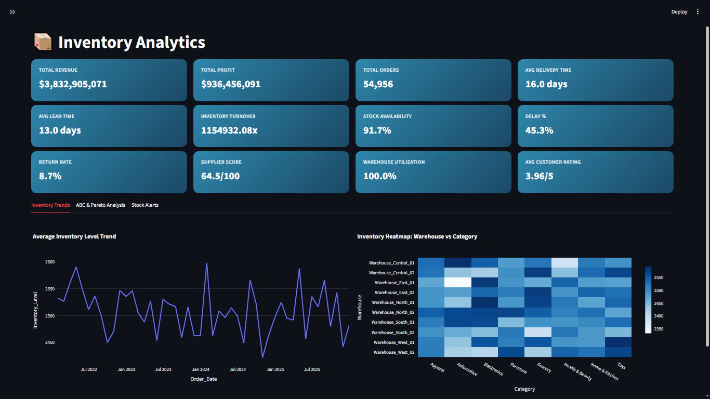
  <br><br>
  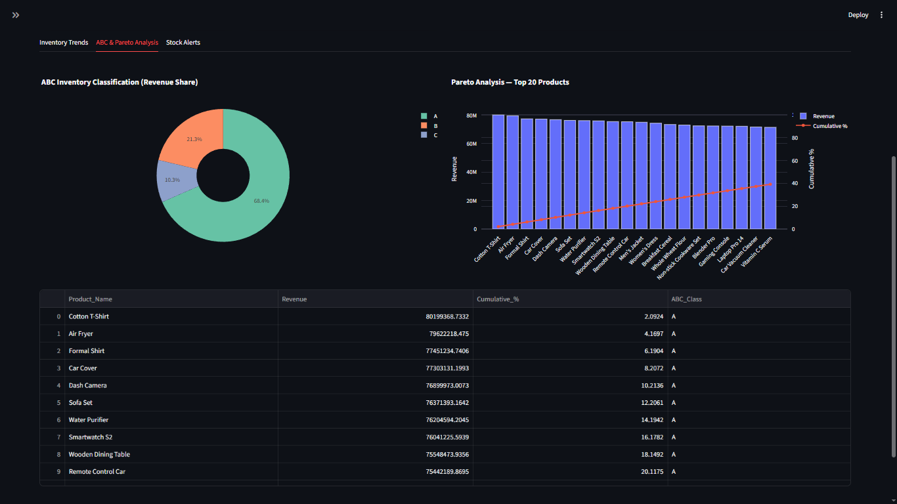
</p>

---

### 🚚 Supplier Analytics

Evaluate supplier performance, lead times, delivery efficiency, and supplier rankings.

<p align="center">
  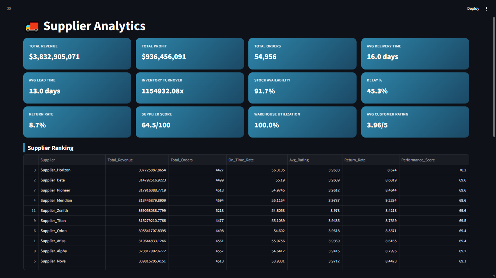
  <br><br>
  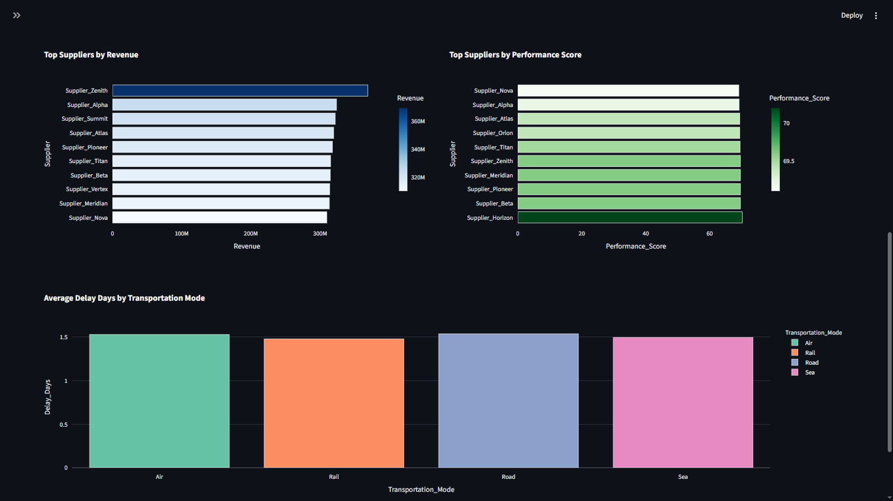
</p>

---

### 🏭 Warehouse Analytics

Track warehouse utilization, inventory distribution, storage performance, and operational efficiency.

<p align="center">
  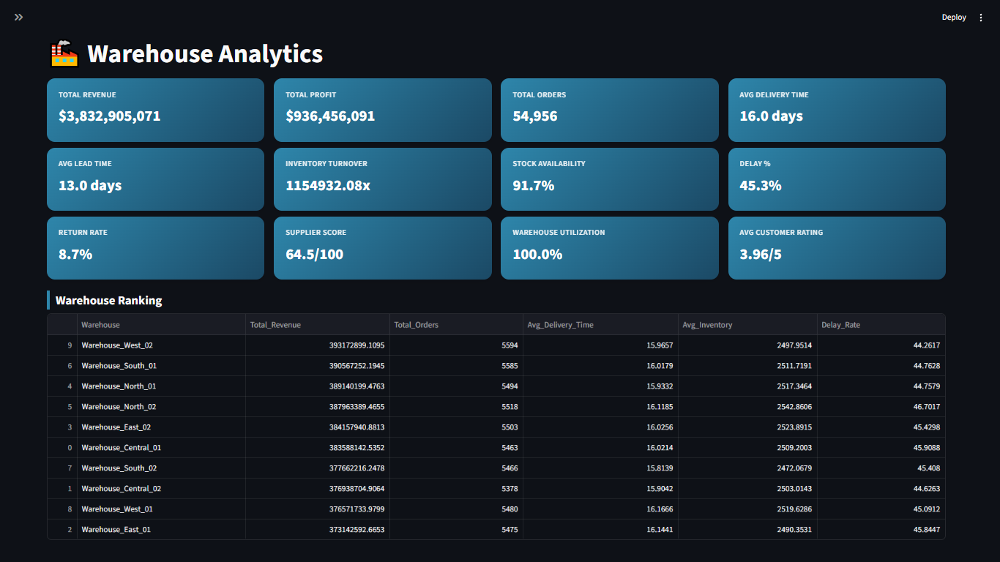
  <br><br>
  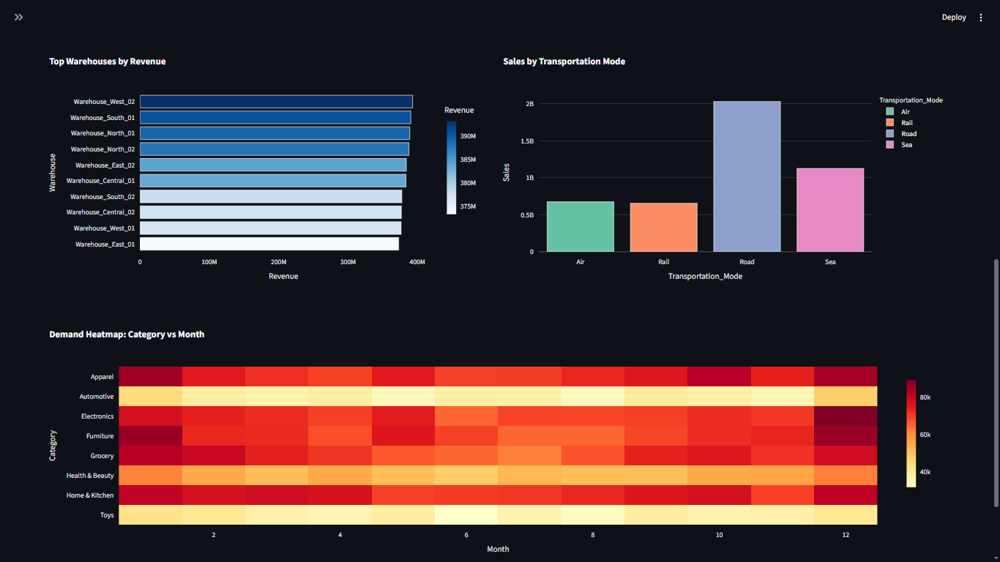
</p>

---

### 🤖 Demand Forecasting

Forecast future product demand using Machine Learning models including Linear Regression, Random Forest, and XGBoost.

<p align="center">
  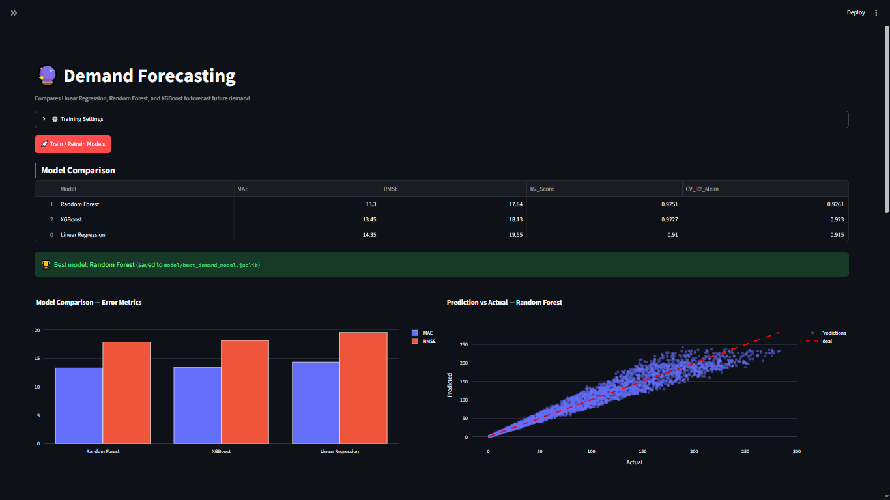
  <br><br>
  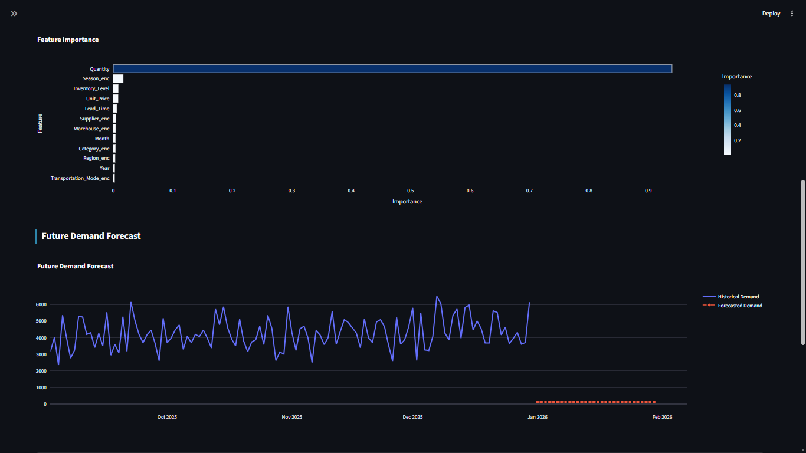
</p>

---

### 📈 Business KPIs

Executive dashboard displaying critical business indicators including Revenue, Profit, Fill Rate, Inventory Value, and Order Performance.

<p align="center">
  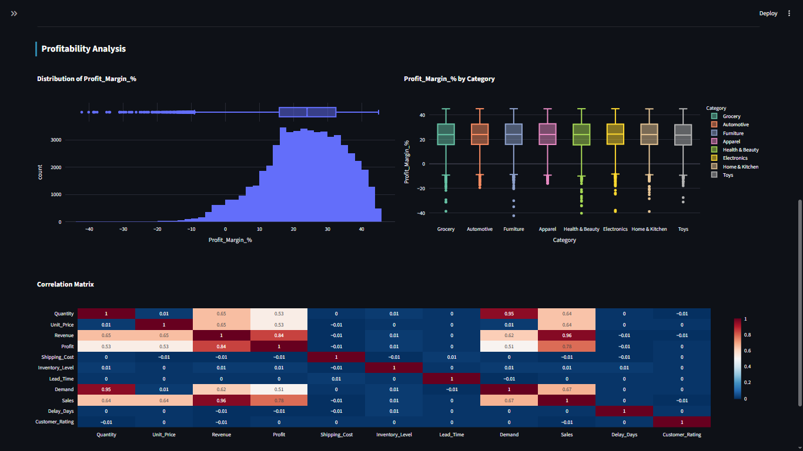
</p>

---

### 📄 Reports

Generate downloadable CSV and PDF reports for business analysis and management presentations.

<p align="center">
  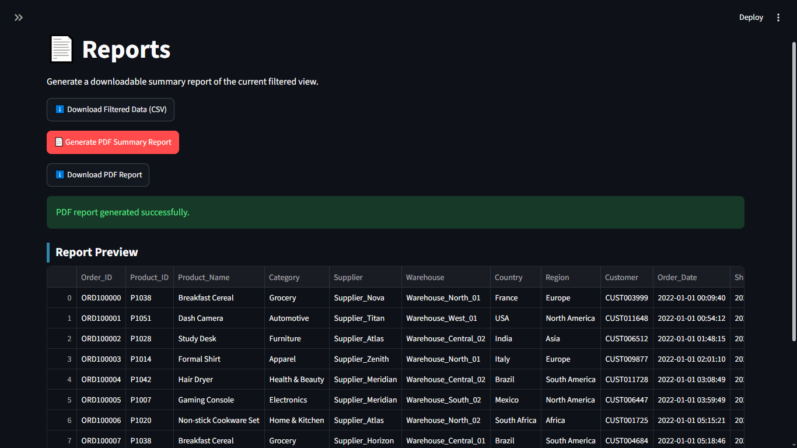
</p>

---

### ℹ️ About Project

Project overview, architecture, technology stack, and implementation details.

<p align="center">
  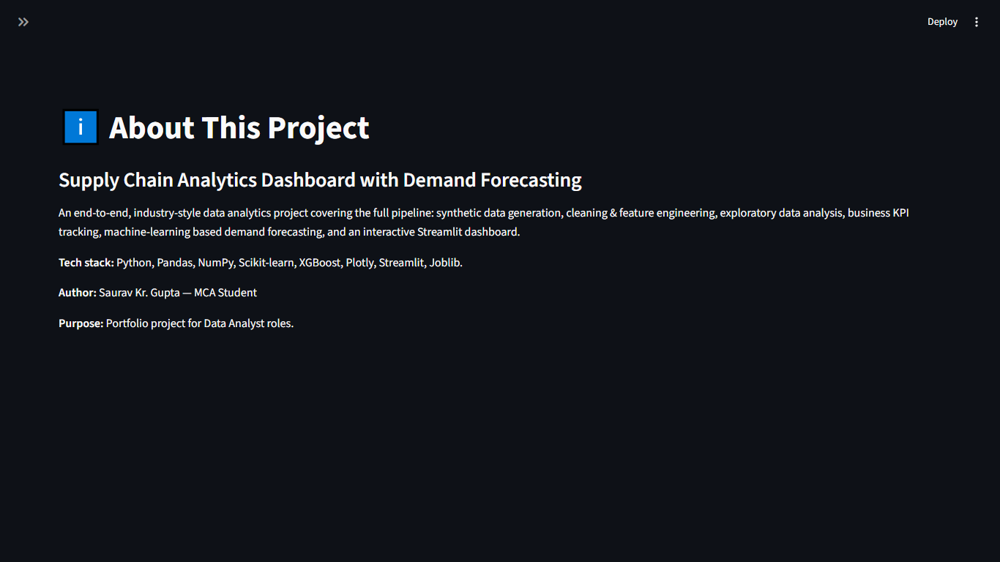
</p>


## 📊 Dashboard Pages

| Page | Contents |
|---|---|
| 🏠 Home | KPI overview, sales & demand snapshot, automatic insights |
| 📈 Sales Analytics | Trends, top products/categories, geography, distributions |
| 📦 Inventory Analytics | Inventory trends, ABC/Pareto analysis, low-stock alerts |
| 🚚 Supplier Analytics | Supplier ranking, performance scoring, delay analysis |
| 🏭 Warehouse Analytics | Warehouse ranking, transportation split, demand heatmap |
| 🔮 Demand Forecasting | Model comparison, prediction vs actual, future forecast |
| 🧮 Business KPIs | Full KPI table, profitability & correlation analysis |
| 📄 Reports | CSV/PDF export of the current filtered view |
| ℹ️ About Project | Project summary |

---

Dataset

↓

Data Cleaning

↓

Feature Engineering

↓

Train-Test Split

↓

Model Training

↓

Model Evaluation

↓

Best Model Saved

↓

Future Demand Prediction

## 📊 Dataset Information

- Source: Synthetic dataset generated for educational purposes.
- Records: 55,000+
- Columns: 30
- Domains: Orders, Products, Warehouses, Suppliers, Shipping, Inventory, Demand.

## 🔮 Future Improvements

- Integrate Facebook Prophet / statsmodels SARIMA for time-series-native forecasting
- Add real-time data ingestion (API / database connector)
- Role-based authentication for multi-user dashboards
- Automated email alerts for low-stock / high-delay conditions
- Deploy to Streamlit Community Cloud or an internal server

---

## 👤 Author

Built by **Saurav** (MCA student) as a portfolio project targeting Data
Analyst roles.
